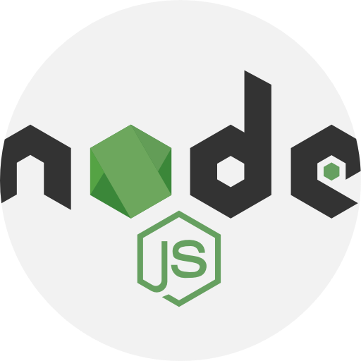
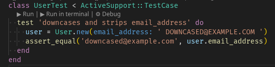

# Gamification Hub

## Setup

### Development dependencies

#### Ruby 3.4.8 

Sugeruję zainstalowanie Ruby przez `rbenv` - Ruby Version Manager.

```sh
$ rbenv install 3.4.8
$ rbenv local 3.4.8
```

Polecam przeczytać:
- [rbenv Basic Git Checkout](https://githuEslintb.com/rbenv/rbenv?tab=readme-ov-file#basic-git-checkout) **Uwaga: nie instalujcie rbenv przez apta! Zainstalujcie przy pomocy skryptu z Gita!**
- [rbenv Installing Ruby Versions](https://github.com/rbenv/rbenv?tab=readme-ov-file#installing-ruby-versions) -  instalowanie Ruby nie jest domyślnie wspierane w rbenv, więc potrzebny jest do tego plugin.

#### Node 25 

Aplikacja korzysta z paczek javascriptowych z NPM.

Sugeruję zainstalowanie przy pomocy `nvm` - Node Version Manager.

Polecam przeczytać:
- [nvm Install & Update Script](https://github.com/nvm-sh/nvm?tab=readme-ov-file#install--update-script)

#### Postgresql 

Nasza baza danych.

Tu jest poradnik jak to skonfigurować na ubuntu: [Install and configure PostgreSQL](https://ubuntu.com/server/docs/how-to/databases/install-postgresql/)

W pliku `config/database.yml` w developmencie oraz w testach przewiduję, że nazwa użytkownika będzie `postgres`, a hasło puste.

Jeżeli u Was to się będzie różnić to się zamieni plik `database.yml` na `database.yml.example` i wtedy sami sobie to doprecyzujecie.

#### Overmind 

Jest to program który pozwala na uruchomienie wielu procesów zdefiniowanych w pliku `Procfile.dev`.

Instalujemy poprzez:
```sh
# Uwaga - nie jest to zależność aplikacji, dlatego tak, a nie w Gemfile
$ gem install overmind
```

### Pierwsze uruchomienie aplikacji

Jeżeli posiadasz powyższe zależności to możesz przejść do pierwszego uruchomienia appki.

Wywołaj:

```sh
$ bin/setup [--reset] [--skip-server]
```

Skrypt ten:
1. Zainstaluje zależności Ruby zdefiniowane w `Gemfile`.
2. Zainstaluje zależności JavaScript i CSS zdefiniowane w `package.json`
3. Przygotuje bazę danych - utworzy bazy oraz puści utworzone w międzyczasie migracje. Jeżeli wywołane z `--reset` to od razu wykonuje reset bazy oraz ponownie uruchamia seedy.
4. Wyczyści logi
5. Uruchomi aplikację o ile nie podaliśmy flagi `--skip-server`

Tyle jeżeli chodzi o setup.

Żeby uruchomić aplikację użyj:

```sh
$ overmind start
```

overmind skorzysta ze zmiennych środowiskowych z pliku `.overmind.env` i uruchomi procesy z `Procfile.dev`

### Konfiguracja credentiali

Credentiale służą do tego, aby w bezpieczny sposób przechowywać ukryte dane w formacie **YAML** w plikach konfiguracyjnych. Wszystkie wrażliwe dane, klucze itd. zarówno testowe jak i produkcyjne powinny właśnie tam być umieszczane.

W repo istnieją pliki `credentials/<env>.yml.enc.example`. Należy je skopiować (albo zrobi to skrypt `bin/setup`) i edytować w nich dane jeżeli będzie taka potrzeba.

Jeżeli w Waszym featurze zostaną dodane nowe dane do plików credentials to proszę o aktualizowanie plików `.example` o jakieś domyślne wartości. Nie commitujcie faktycznych kluczy API itp. do repo.

Aby edytować credentiale należy wklepać:

```sh
$ EDITOR="<nazwa-edytora>" bin/rails credentials:edit --environment <nazwa-środowiska>
```

Przykłady:

```sh
# musi być z flagą --wait, aby VSCode czekał aż sami zamkniemy edytowany plik
$ EDITOR="code --wait" bin/rails credentials:edit --environment development
```

lub

```sh
$ EDITOR="nvim" bin/rails credentials:edit --environment test
```

### Testy

#### Unit i Integration testy

Testy są pisane w railsowych minitestach. Można uruchomić je wszystkie skryptem:

```sh
$ bundle exec rails t
```

lub po po prostu

```sh
$ rails t
```

Ogólnie to `bundle exec` jest raczej rekomendowane, ponieważ wtedy wywołane przez nas skrypty zawsze są uruchamiane w kontekście projektu, a nie w kontekście globalnym.

Pojedyncze testy można uruchomić mając rozszerzenie Ruby LSP do VSCode:



Niestety nie wiem jak w Neovimie to zrobić, @ewez43 możesz sobie dopisać jak będziesz wiedziała :D

#### Testy E2E

<u>Uwaga! Jeszcze niedodane!</u> Testy Playwright dodam nam i skonfiguruję jak będziemy zaczynać stylizować naszą appkę.

Testy end to end pisane są w Playwright. Można go uruchomić skryptem:

```sh
$ bin/playwright
```

### Lintery

W projekcie skonfigurowane są lintery do Ruby oraz JavaScript/TypeScript:
- **Rubocop** - Ruby 
- **ESLint** - JavaScript/TypeScript 

Postarałem się o to, abyście mieli już gotowe automatyczne formatowanie, ale prawdopodobnie będziecie musieli trochę rzeczy dokonfigurować.

Na pewno potrzebujecie rozszerzeń:
- [Ruby LSP](https://marketplace.visualstudio.com/items?itemName=Shopify.ruby-lsp)
- [ESLint](https://marketplace.visualstudio.com/items?itemName=dbaeumer.vscode-eslint)

#### Rubocop

Zasady zdefiniowane są w `.rubocop.yml`

Możecie w konsoli sprawdzić ile naruszeń jest w naszej aplikacji:

```sh
bundle exec rubocop
```

Jeżeli chcecie automatycznie poprawiać błędy to musi być z flagą `-A`:

```sh
bundle exec rubocop -A
```

#### ESLint

Zasady zdefiniowane są w `eslint.config.mjs`.

## Deployment

TBD - jeszcze nie robiliśmy
